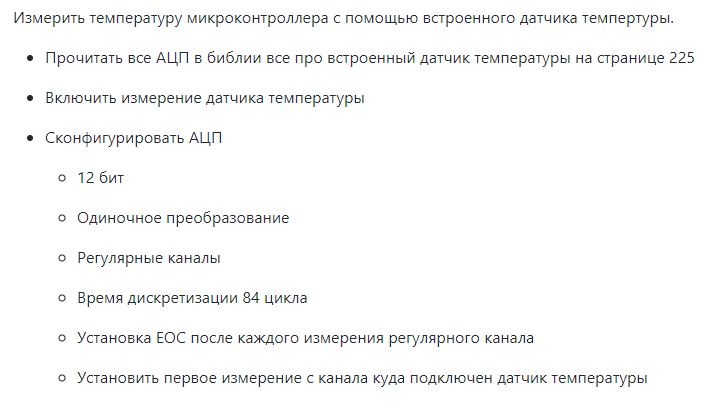
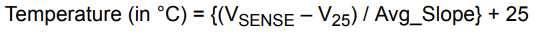
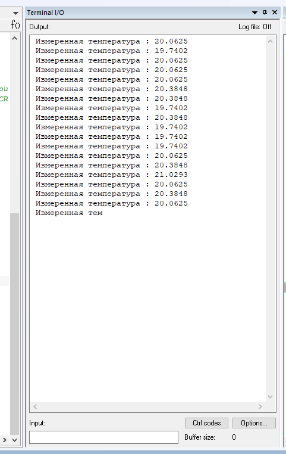

=    *_Лабораторная работа_*

--

*Работа с температурным датчиком*

*Задание:*

*_Ход работы:_*

Целью данной лабораторной работы было создание устройства, способного считывать значения температуры и передавать их
пользователю в консоль.

Для правильной работы устройства был составлен следующий алгоритм:

- _RCC::APB2ENR::ADC1EN::Enable::Set();_
- _ADC1::SQR3::SQ1::Channel18::Set();_
- _ADC_Common::CCR::TSVREFE::Enable::Set();_
- _Работаем с АЦП:_
----
ADC1::CR1::RES::Bits12::Set();
ADC1::CR2::CONT::SingleConversion::Set();
ADC1::CR2::EOCS::SingleConversion::Set();
ADC1::SQR1::L::Conversions1::Set();
ADC1::SMPR1::SMP18::Cycles84::Set();
ADC1::CR2::ADON::Enable::Set();
----
Затем в *Main()*  пишем *ADC1::CR2::SWSTART::On::Set();

В цикле *for(;;)*  проверяем, произошло ли измерение и запрашиваем бит из регистра Data.

Также, для правильного отображения температуры, нужно перевести полученные с устройства данные в
данные, понятные для пользователя. Для этого воспользуемся формулой из *Datasheet*:

Теперь проверим показания в консоли, меняя температуру.

.Программа в работе

Код программы:
[source, cpp]
----
#include <cstdint>
#include "gpioaregisters.hpp"
#include "gpiocregisters.hpp"
#include "gpiobregisters.hpp"
#include "rccregisters.hpp"
#include "tim2registers.hpp"
#include "nvicregisters.hpp"
#include "adc1registers.hpp"
#include "adccommonregisters.hpp"
#include <iostream>

extern "C"
{
  int __low_level_init(void)
  {
    RCC::CR::HSEON::On::Set();
    while (!RCC::CR::HSERDY::Ready::IsSet())
    {
    }
    RCC::CFGR::SW::Hse::Set();

    while (!RCC::CFGR::SWS::Hse::IsSet())
    {
    }
    RCC::CR::HSION::Off::Set();

    RCC::AHB1ENR::GPIOAEN::Enable::Set();
    RCC::AHB1ENR::GPIOCEN::Enable::Set();
    GPIOC::MODER::MODER5::Output::Set();
    GPIOA::MODER::MODER5::Output::Set();
    GPIOC::MODER::MODER9::Output::Set();
    GPIOC::MODER::MODER8::Output::Set();

    RCC::APB2ENR::ADC1EN::Enable::Set();
    ADC1::SQR3::SQ1::Channel18::Set();
    ADC_Common::CCR::TSVREFE::Enable::Set();
    ADC1::CR1::RES::Bits12::Set();
    ADC1::CR2::CONT::SingleConversion::Set();
    ADC1::CR2::EOCS::SingleConversion::Set();
    ADC1::SQR1::L::Conversions1::Set();
    ADC1::SMPR1::SMP18::Cycles84::Set();

    ADC1::CR2::ADON::Enable::Set();

  }
}

   float V25 = 0.76F;
   float AVG_Slope = 0.0025F;
   float Temperature = 0.0F;

int main()
{

  for(;;)
  {
    ADC1::CR2::SWSTART::On::Set();
     while(!ADC1::SR::EOC::ConversionComplete::IsSet())
    {
    };
  uint32_t data =   ADC1::DR::Get(); //Get data from ADC;
  Temperature = ((((data*3.3)/4096 - V25)/AVG_Slope) + 25.0);
  std::cout << " Измеренная температура : " <<  Temperature << std::endl;
  }
}
----